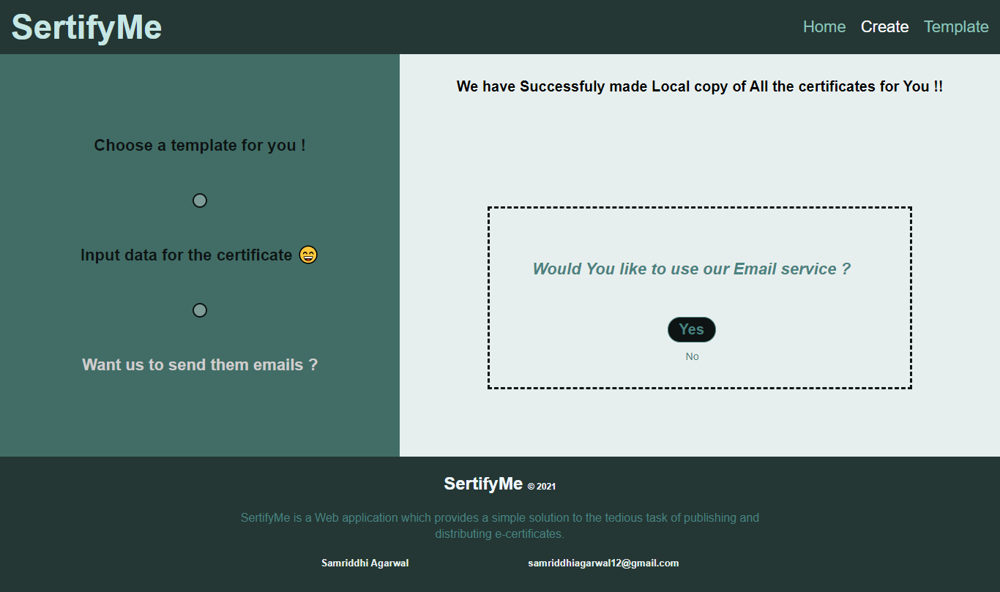

# SertifyMe - Ceritificate Generator

### It is a Web application which provides a simple solution to the tedious task of publishing and distributing e-certificates. 

### SertifyMe is a full solution to all kinds of credential distribution and generation related  problems. From the website users can select their desired certificate format from a rich  design set. In the backend server the application generates, stores and email the  certificates. The website also allows unique Ids to the certificates so they can be verified  from SertifyMe in one click. 

# SertifyMe Interface 

- ## Home page 

- ## Template page 

- ## Creation page

- ## Result 

### There are some Future scope I have in mind to impove the service .